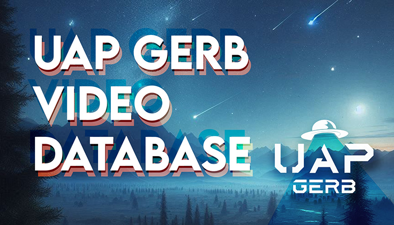

# UAP Gerb Video Database 📽️  
**In-Depth Research on UFOs, UAPs, and Government Secrecy**



## 📋 Table of Contents
- [About](#about)
- [Script Usage](#script-usage)
- [Roadmap](#roadmap)
- [Contributing](#contributing)
- [Contact](#contact)

---

## 🛸 About
**Disclaimer:** This project is not affiliated with Gerb's channel. I just enjoy Gerb's research and wanted to compile this as an open-source resource for all who may be interested.

**UAPGerbVideos** is an open-source project designed to assist dedicated UAP researchers by organizing and expanding on the investigations of **UAP Gerb**. The goal is to create a comprehensive **Obsidian database** hosted on GitHub, where researchers can collaborate through pull requests, refine transcripts, and enhance the collective understanding of UAP phenomena.

This project offers two main tools for researchers:
1. **Custom GPT Integration:** An AI trained on the curated data to provide detailed answers and analysis based on UAP Gerb’s research corpus.  
2. **Obsidian’s Graph View:** A powerful way to visualize connections between cases, whistleblower testimonies, government secrecy, and other UAP-related topics.

**Key Features:**
- **Hand-Checked Transcripts:** Transcripts are verified by both humans and AI to ensure accuracy and reliability.  
- **Collaborative Platform:** Researchers can propose changes, add new cases, and refine existing content.  
- **Comprehensive Scope:** Focuses on the **37 public videos** posted by UAP Gerb, covering incidents, reverse engineering claims, government secrecy, and more.

**Long-Term Vision:**
To evolve into a broader **open-source UAP/UFO investigation tool**, integrating data from other researchers and leveraging AI to uncover patterns and insights.  

For AI-based analysis and questions, use the [UAP Gerb Research Assistant](https://chatgpt.com/g/g-67baa97585e08191bb015cca779fd47a-uap-gerb-research-assistant).  

## 📌 Project Overview
This repository serves as the **central database** for the UAP Gerb Video research project. The primary function of this repository is to be used with **Obsidian**, a markdown-based knowledge management tool, to organize and explore research on **Unidentified Aerial Phenomena (UAPs)**.

---

### 🔍 How to Use This Repository
1. **Open in Obsidian**: This repository is structured to function as an **Obsidian Vault**. To correctly view the research files:
   - Download or clone the repository.
   - Open **Obsidian** and select `UAPGerb` as the Vault directory.
   - Navigate using links, tags, and structured markdown notes.

2. **Explore the Research**:
   - Each video has a corresponding markdown file with **timestamps, summaries, and cross-referenced materials**.
   - Tags and backlinks help connect related topics, testimonies, and incidents.
   
3. **Contribute & Improve**:
   - Fork this repository and submit **pull requests** to help organize, expand, and improve the documentation.
   - Ensure new content is formatted properly for Obsidian.
   - Follow the directory structure and tagging conventions.

### 📂 Repository Structure
- `UAPGerb/` → The **main folder** that should be opened as an **Obsidian Vault**.
- `01_Incidents/` → Historical UAP cases (e.g., Roswell, Malmstrom AFB, USS Trepang USO).
- `02_Whistleblowers/` → Testimonies from figures like David Grusch and Bob Lazar.
- `03_Government_Secrecy/` → Programs, leaked documents, and classified initiatives.
- `04_Military_Encounters/` → Global military reports of UAP activity.
- `README.md` → This guide.

### 🚀 Get Involved
- **Clone the repository**: `git clone https://github.com/DuelingGroks/UAP-Gerb-Video-Database.git`
- **Submit a pull request**: Help improve the structure and add missing research.
- **Join the discussion**: Connect with other researchers and share findings.

By maintaining and expanding this database, we aim to create a well-organized, accessible resource for anyone investigating **UAP-related evidence, testimonies, and historical incidents.**

---
## 🖥️ Script Usage
The `UAPGerb_Repo_Manager.py` script automates the corpus generation AI files with the following tasks:
1. **Generates a comprehensive Word document** (`Full UAP Gerb Video Obsidian Corpus.docx`) with all `.md` files.
2. **Splits the `07 Gerbs UAP Video Analyses` folder** into five separate Word documents.
3. **Builds a folder tree view** (`folder_tree.txt`).

**To run the script:**

```bash
python UAPGerb_Repo_Manager.py
```
---
## Usage

Upload the AIGerbCorpus files into an AI of your choice's memory and ask it questions, or use this one we made for you: [UAP Gerb Research Assistant](https://chatgpt.com/g/g-67baa97585e08191bb015cca779fd47a-uap-gerb-research-assistant)


---

## 🗺️ Roadmap
- [x] **Corpus Automation Script**
- [x] **Put Transcripts In All Videos** Adobe CC AI Transcribed
- [x] **Video 1-19:** Correct Transcript (Mostly Proper Nouns)
- [x] **Video 38:** Partial Corrections
- [ ] **Video 14–37:** Pending

---

## 🤝 Contributing
Contributions are welcome! Feel free to open issues or submit pull requests.

1. Fork the repository.  
2. Create a new branch.  
3. Make your changes.  
4. Submit a pull request.  

---

## 📬 Contact
- **Twitter**: [@DuelingGroks](https://twitter.com/DuelingGroks)
- **Discord**: [Join the UAPGerb Discord](https://discord.gg/6QtS4VQFtU)  
- **YouTube**: [UAPGerb Channel](https://www.youtube.com/channel/UCnleKTPNvL2kzBS9F2ryzpA)  
